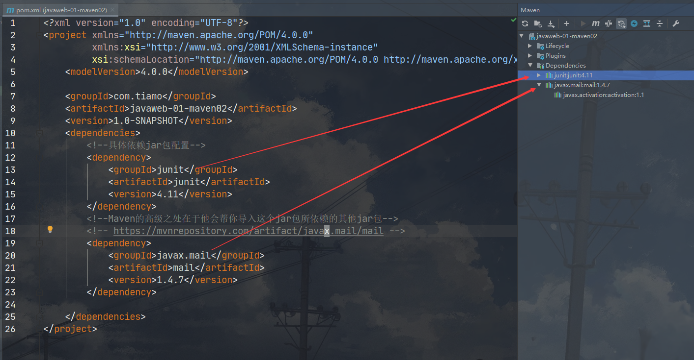

[TOC]


# JavaWeb

java	web

## 1.基本概念

### 1.1 前言

web开发

- web，网页的意思，https://www.baidu.com/
- 静态web
  - html，css
  - 提供给所有人看的数据始终不会发生变化！
- 动态web
  - 淘宝，几乎是所有的网站；
  - 提供给所有人看的数据始终会发生变化，每个人不同的时间，不同的地点看到的的信息各不相同！
  - 技术栈：servlet/jsp、ASP、PHP

在javaweb中，动态web资源开发的技术统称为Javaweb

### 1.2、web应用程序

web应用程序：可以提供浏览器访问的程序;

- a.html、b.htm..多个web资源，这些web资源可以被外界访问，对外界提供服务;
- 能访问到的任何一个页面或者资源，都存在于这个世界上的某一个角落的计算机上
- URL
- 这个这个统一的web资源会被放在同一个文件夹下，web应用程序-->tomcat：服务器
- 一个web应用有多部分组成（静态web，动态web）
  - html、css、js
  - jsp、servlet
  - java程序
  - jar包
  - 配置文件

web应用程序编写完毕后，若想提供给外界访问:需要一个服务器来统一管理;

### 1.3、静态web

- *.htm, *.html,这些都是网页的后缀，如果服务器上一直存在这些东西，我们就可以直接进行读取。通络;


- ​	静态web存在的缺点
  - Web页面无法动态更新，所有用户看到的都是同一个页面
    - 轮播图，点击特效:伪动态
    - JavaScript [实际开发中，它用的最多]
    - vBScript
  - 他无法和数据库交互（数据无法持久化，用户无法交互）

### 1.4 动态WEB

页面会动态展示："Web的页面展示的效果因人而异"；


缺点：

- 假如服务器的动态web资源出现了错误，我们需要重新编写我们的**后台程序**，重新发布
  - 停机维护

优点：

- Web页面可以动态更新，所有用户看到的都不是同一个页面
- 它可以和数据库交互（数据持久化，注册，商品信息，用户信息）


## 2、web服务器

### 2.1 技术讲解

ASP服务器

- 微软：国内最早流行的服务器
- 在HTML中嵌入了VB的脚本，ASP + COM；
- 在ASP开发中，基本一个页面都有几千行的代码，页面及其混乱
- 维护成本高！
- C#

```html
<h1>
    <h1></h1>
    <h1>
        <h1></h1>
        <%
           System.out.println("hello");
           %>
    </h1>
</h1>

```

PHP

- PHP开发速度很快，功能很强大，跨平台，代码很简单
- 无法承载大访问量的情况（局限性）


**JSP/Servlet：**

B/S：浏览器和服务器

C/S：客户端和服务器

- sun公司主推的B/S架构
- 基于java语言的；(所有的大公司或者一些开源的软件都是用Java写的)
- 可以承载三高问题带来的影响；（高并发，高可用，高性能）；
- 语法像ASP，ASP--》ISP，加强市场强度；

。。。。


### 2.2、web服务器

服务器是一种被动的操作，用来处理用户的一些请求和给用户一些响应信息;

**IIS**

微软的：ASP>...Windows中自带的文件-项目

**Tomcat**


面向百度编程;

Tomcat是Apache 软件基金会（Apache Software Foundation）的Jakarta 项目中的一个核心项目，最新的Servlet 和JSP 规范总是能在Tomcat 中得到体现。因为Tomcat 技术先进、性能稳定，而且免费，因而深受Java 爱好者的喜爱并得到了部分软件开发商的认可，成为目前比较流行的Web 应用服务器。

Tomcat 服务器是一个免费的开放源代码的Web 应用服务器，属于轻量级应用[服务器](https://baike.baidu.com/item/服务器)，在中小型系统和并发访问用户不是很多的场合下被普遍使用，是开发和调试JSP 程序的首选。对于一个初学者来说，他是最佳的选择

Tomcat 实际上运行JSP 页面和Servlet。另外，Tomcat和[IIS](https://baike.baidu.com/item/IIS)等Web服务器一样，具有处理HTML页面的功能，另外它还是一个Servlet和JSP容器，独立的Servlet容器是Tomcat的默认模式。不过，Tomcat处理静态[HTML](https://baike.baidu.com/item/HTML)的能力不如Apache服务器。目前Tomcat最新版本为**9.0.37****

.....

**工作3-5年之后，可以尝试手写Tomcat服务器；**

下载Tomcat：

1. 安装 or 解压
2. 了解配置文件及目录结构
3. 了解这个东西的作用

## 3 、Tomcat

### 3.1、安装Tomcat

[Tomcat官网]: https://tomcat.apache.org/


### 3.2、Tomcat启动和配置

文件夹目录信息：


启动、关闭Tomcat：


访问测试：http://localhost:8080/

可能遇到的问题：

1. Java环境变量配置问题
2. 闪退问题：需要配置兼容性
3. 乱码问题：配置文件中设置

### 3.3、配置


可以配置启动的端口号：

- Tomcat的默认端口号：**8080**
- MySQL端口号：**3306**
- HTTP：**80**
- HTTPS：**443**

 ```xml
 <Connector port="8080" protocol="HTTP/1.1"
               connectionTimeout="20000"
               redirectPort="8443" URIEncoding="UTF-8" />
 ```

可配置的主机名称：

- 默认的主机名为：`localhost->127.0.0.1`
- 默认网站应用存放地位置为：`webapps`

```xml
<Host name="localhost"  appBase="webapps"
            unpackWARs="true" autoDeploy="true">
```

#### 高难度面试题：

请你谈谈网站是如何进行访问的！

1. 输入一个域名；回车

2. 检查本机的`C:\Windows\System32\drivers\etc\hosts`配置文件下有没有这个域名映射;

   1. ​	有:直接返回对应的ip地址，这个地址中，有我们需要访问的web程序，可以直接访问

      ```java
      127.0.0.1	https://www.baidu.com/ 
      ```

      

   2. 没有：去DNS服务器找，找到的话就返回，找不到就返回找不到;

   

   

   3. 可以配置一下环境变量

### 4、发布项目

- 将自己写的网站，放到服务器(Tomcat)中指定的web应用的文件夹(webapps)下，就可以访问了

网站应该有的结构

```java
--webapps : Tomcat服务器的web目录
	-ROOT
	-Tiamo : 网站的目录名
		- WEB-工NF
			-classes : java?
			-lib: web应用所依赖的jar包
			-web. xm1 :网站配置文行
		- index.htm1默认的首页
		- static
            -css
            	-style.css
            -js
            -img
		-......

```

HTTP协议：面试

Maven：构建工具

- Maven安装包

Servlet入门

- helloword!
- servlet配置
- 原理

## 4、http

### 4.1、什么是Http

- HTTP(超文本传输协议）是一个简单的请求-响应协议，它通常运行在TCP之上。
- 文本: html，字符串，~...-
- 超文本:图片，音乐，视频，定位，地图....---
- 80

### 4.2、两个时代

- http1.0
  - HTTP/1.0：客户端可以与wbe服务器连接后，只能获得一个web资源，断开连接
- http2.0
  - HTTP/1.1：客户端可以与wbe服务器连接后，可以获得多个web资源，断开连接

### 4.3、Http请求

- 客户端---发请求(Request) ---服务器

百度：

```java
Request URL: https://www.baidu.com/		请求地址
Request Method: GET		get方法/post方法
Status Code: 200 OK		状态码：200
Remote Address: 111.206.223.172:443
```

```java
Accept: text/html 
Accept-Encoding: gzip, deflate, br
Accept-Language: zh-CN,zh;q=0.9
Cache-Control: max-age=0
Connection: keep-alive
```

#### 1.请求行

- 请求行中的请求方式：GET
- 请求方式：Get/Post，HEAD，DELETE，PUT，TRACT...
  - get：请求能够携带的参数比较小，大小有限制，会在浏览器的URL地址栏内显示数据内容，不安全
  - post:请求能够携带的参数没有限制，大小没有限制，不会在浏览器的URL地址栏显示数据内容，安全，但不高效。

#### 2.请求头

```java
Accept:	告诉浏览器，它所支持的数据类型
Accept-Encoding: 支持那种编码格式：GBK	UTF-8	GB2312 ISO8859-1
Accept-Language: 告诉浏览器他的语言环境
Cache-Control: 缓存控制
Connection: 告诉浏览器，请求尧成是斯开还是保持连接
HOST：主机....
```


### 4.4、Http响应

- 服务器---响应----客户端

百度：

```java
Cache-Control: private		缓存控制
Connection: keep-alive		连接：
Content-Encoding: gzip		编码
Content-Type: text/html;	类型
```

#### 1.响应体

```java
Accept:	告诉浏览器，它所支持的数据类型
Accept-Encoding: 支持那种编码格式：GBK	UTF-8	GB2312 ISO8859-1
Accept-Language: 告诉浏览器他的语言环境
Cache-Control: 缓存控制
Connection: 告诉浏览器，请求尧成是斯开还是保持连接
HOST：主机....
Refrush: 告诉客户端，多久刷新一次；
location: 让网页重新定位；
```

#### 2.响应状态码

#### **HTTP状态码分类**

共分为5种类型：

| **分类** | **分类描述**                                   | 例                                 |
| -------- | ---------------------------------------------- | ---------------------------------- |
| 1xx      | 信息，服务器收到请求，需要请求者继续执行操作   |                                    |
| 2xx      | 成功，操作被成功接收并处理                     | 200                                |
| 3xx      | 重定向，需要进一步的操作以完成请求             |                                    |
| 4xx      | 客户端错误，请求包含语法错误或无法完成请求     | 404                                |
| 5xx      | 服务器错误，服务器在处理请求的过程中发生了错误 | 502：网关错误； 500:服务器代码错误 |

#### 常见面试题：

当你的浏览器地址栏输入地址并回车的一瞬间到页面能够展示回来，经历了什么？


## 5、Maven

**我为什么要学习这个技术**?

1. 在Javaweb开发中，需要使用大量的jar包，我们手动去导入;
2. 如何能够让一个东西自动帮我导入和配置这个jar包。由此，Maven诞生了!

### 5.1 、Maven项目架构管理工具

我们目前用来就是方便导入jar包的！

Maven的核心思想：**约定大于配置**

- 有约束，不要去违反

Maven会规定好你该如何去编写我们的avaf代码，必须要按照这个规范来;

### 5.2、下载安装Maven

官网：http://maven.apache.org/


下载完成后解压至自己的文件夹即可；

建议：电脑上的所有环境都放在一个文件夹下，方便管理;

### 5.3、配置环境变量

在我们的系统环境变量中

配置如下配置：

| 变量名称         | 变量值               |
| ---------------- | -------------------- |
| `M2_HOME`        | Maven目录下的bin目录 |
| `MAVEN_HOME`     | Maven的目录          |
| 系统变量：`path` | Maven目录下的bin目录 |

例：

- `M2_HOME`和`MAVEN_HOME`

  

- `path` %MAVEN_HOME%\bin

  

- **注：以上路径均为`自己的文件存放路径`**


测试Maven是否安装成功，必须保证配置完毕

### 5.4、配置阿里云镜像

- 镜像:`mirrors`
  - 作用:加速我们的下载

- 国内建议使用阿里云的镜像

1. maven目录下的`conf`文件夹`settings.xml`文件在`mirrors`标签内添加以下代码

```xml
<!-- 阿里云的远程仓库 -->
    <mirror>
        <id>alimaven</id>
        <name>aliyun maven</name>
        <url>http://maven.aliyun.com/nexus/content/groups/public/</url>
        <mirrorOf>central</mirrorOf>
    </mirror>
```

### 5.5、本地仓库

在本地的仓库，远程仓库;

**建立一个仓库**：

1. 在maven文件目录下创建一个文件夹名为`maven-repo`

2. 在`settings.xml`文件中添加

   ```xml
   <localRepository>D:\JavaResource\maven\apache-maven-3.6.3\maven-repo</localRepository>
   --路径为自己的文件存放位置
   ```

### 5.6、在IDEA中使用Maven

1. 启动IDEA

2. 创建一个Maven项目

   1. 

   2. 

   3. 
   
      
   
3. 等待项目导入完毕

   1. 

4. 观察maven仓库中多了什么东西？

5. IDEA中的maven配置

   1. IDEA创建成功后，查看maven配置
   2. 
   3. 

6. 到这里，maven在IDEA中的配置和使用就OK了!

### 5.7、创建一个普通的maven项目

1. 

2. 

3. 这个只有在web应用下才会有

   

4. 使用maven模板创建的项目是没有`java`和`resource`文件夹的需要手动创建

   1. IDEA2020版本的会在创建`java`和`resource`文件夹时提示选择文件夹类型
   2. 其他版本需要手动改变文件夹类型

### 5.8、在IDEA中标记文件夹功能

- 
- 
- 

### 5.9、在IDEA中配置Tomcat

1. 

2. 

3. 

   1. 解决警告问题：

      为什么会有这个问题:我们访问一个网站，需要指定一个文件夹名字;

   2. 

   3. 

   4. 

4. 


### 5.10、pom文件

`pom.xml`是maven的**核心配置文件**


```xml
<?xml version="1.0" encoding="UTF-8"?>
<!--Mavne版本和头文件-->
<project xmlns="http://maven.apache.org/POM/4.0.0" xmlns:xsi="http://www.w3.org/2001/XMLSchema-instance"
  xsi:schemaLocation="http://maven.apache.org/POM/4.0.0 http://maven.apache.org/xsd/maven-4.0.0.xsd">
  <modelVersion>4.0.0</modelVersion>
  <!--Package:项目的打包方式
  jar: java应用
  war: Javaweb应用
  -->
  <groupId>com.tiamo</groupId>
  <artifactId>javawe-01-maven</artifactId>
  <version>1.0-SNAPSHOT</version>
  <packaging>war</packaging>

  <name>javawe-01-maven Maven Webapp</name>
  <!-- FIXME change it to the project's website -->
  <url>http://www.example.com</url>
  <!--配置-->
  <properties>
    <!--项目默认编码格式-->
    <project.build.sourceEncoding>UTF-8</project.build.sourceEncoding>
    <!--编码版本-->
    <maven.compiler.source>1.7</maven.compiler.source>
    <maven.compiler.target>1.7</maven.compiler.target>
  </properties>
  <!--项目依赖jar包-->
  <dependencies>
    <dependency>
      <groupId>junit</groupId>
      <artifactId>junit</artifactId>
      <version>4.11</version>
      <scope>test</scope>
    </dependency>
  </dependencies>
  <!--项目构建用的东西-->
  <build>
    <finalName>javawe-01-maven</finalName>
    <pluginManagement><!-- lock down plugins versions to avoid using Maven defaults (may be moved to parent pom) -->
     
    </pluginManagement>
  </build>
</project>

```




maven由于他的约定大于配置，我们之后可以能遇到我们写的配置文件，无法被导出或者生效的问题，解决方案:

### 关于在maven项目中配置文件资源导出问题

```xml
<!-- 在build中配置resources，来防止我们资源导出问题 -->
<build>
<resources>
  <resource>
    <directory>src/main/resources</directory>
    <includes>
      <include>**/*.properties</include>
      <include>**/*.xml</include>
    </includes>
    <filtering>true</filtering>
  </resource>
  <resource>
    <directory>src/main/java</directory>
    <includes>
      <include>**/*.properties</include>
      <include>**/*.xml</include>
    </includes>
    <filtering>true</filtering>
  </resource>
</resources>
</build>
```


## 6、Servlet

### 6.1、Servlet简介

- Servlet就是sun公司开发动态web的一门技术
- Sun在这些API中提供一个接口叫做:Servlet，如果你想开发一个Servlet程序，只需要完成两个小步骤:
  - 编写一个类，实现Servlet接口
  - 把开发好的ava类部署到web服务器中。

**把实现了Servlet接口的Java程序叫做，Servlet**

### 6.2、Helloservlet

servlet在Sun公司有两个默认的实现类：HttpServlet，GenericServlet


1. 构建一个普通的Maven项目，删掉里面的src目录，以后我们的学习就在这个项目里面建立Moudel;这个空的
   工程就是Maven主工程;

2. 关于Maven父子工程的理解:

   父项目会有

   ```xml
   <modules>
           <module>servlet-01</module>
   </modules>
   ```

   子项目会有

   ```xml
   <parent>
       <artifactId>javaweb-O2-servlet</artifact1d>
       <groupId>com.kuang</groupId>
       <version>1.O-SNAPSHOT</version>
   </parent>
   ```

   父项目中的子项目可以直接使用

   ```java
   son extends	father
   ```

3. Maven环境优化

   1. 修改`web.xml`为最新的

      ### web.xml

      - ```xml
        <?xml version="1.0" encoding="UTF-8"?>
        <web-app xmlns="http://xmlns.jcp.org/xml/ns/javaee"
                 xmlns:xsi="http://www.w3.org/2001/XMLSchema-instance"
                 xsi:schemaLocation="http://xmlns.jcp.org/xml/ns/javaee
                                        http://xmlns.jcp.org/xml/ns/javaee/web-app_4_0.xsd"
                 version="4.0"
                 metadata-complete="true">
        
        
        </web-app>
        ```

   2. 将maven的结构搭建完整

4. 编写一个servlet程序

   1. 编写一个普通类

   2. 实现servlet接口，这里直接继承HttpServlet

      ```java
      public class HelloServlet extends HttpServlet {
          //由于GET或者POST只是请求的不同方式，可以互相调用
          @Override
          protected void doGet(HttpServletRequest req, HttpServletResponse resp) throws ServletException, IOException {
              //ServletOutputStream outputStream = resp.getOutputStream();
              PrintWriter writer = resp.getWriter();
              writer.println("Hellow Word");
          }
      
          @Override
          protected void doPost(HttpServletRequest req, HttpServletResponse resp) throws ServletException, IOException {
              super.doPost(req, resp);
          }
      }
      ```

5. 编写Servlet的映射

   为什么需要映射:我们写的是JAVA程序，但是要通过浏览器访问，而浏览器需要连接web服务器，所以我们需要再web服务中注册我们写的Servlet，还需给他一个浏览器能够访问的路径;

   ```xml
   <!--注册Servlet-->
       <servlet>
           <servlet-name>hello</servlet-name>
           <servlet-class>com.tiamo.servlet.HelloServlet</servlet-class>
       </servlet>
       <!--Servlet的请求路径-->
       <servlet-mapping>
           <servlet-name>hello</servlet-name>
           <url-pattern>/hello</url-pattern>
       </servlet-mapping>
   ```

6. 配置Tomcat

   注意：配置项目发布的路径

7. 启动测试

### 6.3、Servlet原理

Servlet是由web服务器调用，web服务器在收到浏览器请求之后，会：


### 6.4、Mapping

1. 一个Servlet可以指定一个映射路径

   ```xml
   <servlet-mapping>
       <servlet-name>hello</servlet-name>
       <url-pattern>/hello</url-pattern>
   </servlet-mapping>
   ```

2. 一个Servlet可以指定多个映射路径

   ```xml
   	<servlet-mapping>
           <servlet-name>hello</servlet-name>
           <url-pattern>/hello</url-pattern>
       </servlet-mapping>
       <servlet-mapping>
           <servlet-name>hello</servlet-name>
           <url-pattern>/hello2</url-pattern>
       </servlet-mapping>
       <servlet-mapping>
           <servlet-name>hello</servlet-name>
           <url-pattern>/hello3</url-pattern>
       </servlet-mapping>
       <servlet-mapping>
       <servlet-name>hello</servlet-name>
       <url-pattern>/hello4</url-pattern>
       </servlet-mapping>
   ```

3. 一个Servlet可以指定通用映射路径

   ```xml
    <servlet-mapping>
           <servlet-name>hello</servlet-name>
           <url-pattern>/hello/*</url-pattern>
       </servlet-mapping>
   ```

4. 默认请求路径

   ```
   <!--默认请求路径-->
   <servlet-mapping>
       <servlet-name>hello</servlet-name>
       <url-pattern>/*</url-pattern>
   </servlet-mapping>
   ```

5. 指定一些后缀或者前缀

   ```xml
   <!--可以自定义后缀实现请求映射
       注意点：*前面不能加映射的路径
   	hello/sfasd.tiamo
       -->
   <servlet-mapping>
       <servlet-name>hello</servlet-name>
       <url-pattern>*.do</url-pattern>
   </servlet-mapping>
   ```

6. 优先级问题：

   制定了固有的映射路径优先级最高，如果找不到就会走默认的处理请求

   ```xml
   <!--404-->
   <servlet>
       <servlet-name>erro</servlet-name>
       <servlet-class>com.tiamo.servlet.ErroServlet</servlet-class>
   </servlet>
   <servlet-mapping>
       <servlet-name>erro</servlet-name>
       <url-pattern>/*</url-pattern>
   </servlet-mapping>
   ```

   

### 6.5、Servlet Context

ServletContext官方叫servlet上下文。`服务器会为每一个工程创建一个对象`，这个对象就是ServletContext对象。这个对象`全局唯一`，而且工程内部的所有`servlet都共享这个对象`。所以叫`全局应用程序共享对象`。

### 1、 共享数据

在这个Servlet中保存的值，可以在其他servlet中拿到；

```java
public class HelloServlet extends HttpServlet {
    @Override
    protected void doGet(HttpServletRequest req, HttpServletResponse resp) throws ServletException, IOException {
        //this.getInitParameter();  初始化阐述
        //this.getServletConfig();  servlet配置
        //this.getServletContext(); servlet上下文
        ServletContext context = this.getServletContext();
        //数据
        String username = "秦将";
        //将一个数据保存在了ServletContext中，名字为username，值username
        context.setAttribute("username",username);

        resp.getWriter().print("Hello");
    }
}
```

```java
public class GetServlet extends HttpServlet {
    @Override
    protected void doGet(HttpServletRequest req, HttpServletResponse resp) throws ServletException, IOException {
        resp.setContentType("text/html;charset=utf-8");
        ServletContext context = this.getServletContext();
        String username = (String) context.getAttribute("username");
        resp.getWriter().println("名字是："+username);
    }
    @Override
    protected void doPost(HttpServletRequest req, HttpServletResponse resp) throws ServletException, IOException {
        doGet(req, resp);
    }
}
```

```xml
<servlet>
    <servlet-name>hello</servlet-name>
    <servlet-class>com.tiamo.servlet.HelloServlet</servlet-class>
</servlet>
<servlet-mapping>
    <servlet-name>hello</servlet-name>
    <url-pattern>/hello</url-pattern>
</servlet-mapping>

<servlet>
    <servlet-name>getc</servlet-name>
    <servlet-class>com.tiamo.servlet.GetServlet</servlet-class>
</servlet>
<servlet-mapping>
    <servlet-name>getc</servlet-name>
    <url-pattern>/getc</url-pattern>
</servlet-mapping>
```

- 测试访问：


### 2、获取初始化参数

```xml
<!--配置一些web应用的初始化参数-->
<context-param>
    <param-name>url</param-name>
    <param-value>jdbc:mysql://localhost:3306/mybatis</param-value>
</context-param>
```

```java
protected void doGet(HttpServletRequest req, HttpServletResponse resp) throws ServletException, IOException {
    resp.setContentType("text/html;charset=utf-8");
    ServletContext context = this.getServletContext();
    String url = context.getInitParameter("url");
    resp.getWriter().print(url);
}
```


### 3、请求转发

```java
protected void doGet(HttpServletRequest res, HttpServletResponse resp) throws ServletException, IOException {
    ServletContext context = this.getServletContext();
    System.out.println("进入了ServletDemo04");
    //转发的请求路径
    //RequestDispatcher requestDispatcher = context.getRequestDispatcher("/gp");
    //调用forward实现转发请求
    //requestDispatcher.forward(res,resp);
    context.getRequestDispatcher("/gp").forward(res,resp);
}
```


### 4、读取在资源文件

Properties

- 在Java目录下新建Properties
- 在resources目录下新建Properties

发现：都被打包到了同一个路径下：`classes`，我们俗称这个路径为`classpath`

思路：需要一个文件流：

```properties
username=root
password=123456
```

```java
public class ServletDemo05 extends HttpServlet {
    @Override
    protected void doGet(HttpServletRequest request, HttpServletResponse response) throws ServletException, IOException {
        // 处理post请求乱码问题
        request.setCharacterEncoding("utf-8");
        // 处理响应乱码问题:字节流需getBytes("UTF-8")
        response.setContentType("text/html;charset=utf-8");
        InputStream is = this.getServletContext().getResourceAsStream("/WEB-INF/classes/com/tiamo/servlet/aa.properties");
        Properties prop = new Properties();
        prop.load(is);
        String user = prop.getProperty("username");
        String pwd = prop.getProperty("password");
        response.getWriter().print("user："+user+"pwd："+pwd);
    }
    @Override
    protected void doPost(HttpServletRequest request, HttpServletResponse response) throws ServletException, IOException {
        this.doGet(request, response);
        //response.setContentType("text/html;charset=UTF-8"); // 处理响应乱码问题:字节流需getBytes("UTF-8")
        // str = new String(str.getBytes("ISO-8859-1"), "UTF-8");//处理get请求乱码问题
    }
}
```

访问测试即可；

### 6.6、HttpServletResponse

响应：

web服务器接收到客户端的http请求，针对这个请求，分别创建一个代表请求的HttpServletRequest对象，代表响应的HttpServletResponse；

- 如果要获取客户端请求过来的参数:找HttpServletRequest
- 如果要给客户端响应一些信息:找HttpServletResponse

### 1、简单分类

#### 负责向浏览器发送数据的方法

```java
//文件流
ServletOutputStream getOutputStream() throws IOException;
PrintWriter getWriter() throws IOException;//中文
```

#### 负责向浏览器发送响应头的方法

```java
void setCharacterEncoding(String var1);

void setContentLength(int var1);

void setContentLengthLong(long var1);

void setContentType(String var1);

//ServletResponseClass
void setDateHeader(String var1, long var2);

void addDateHeader(String var1, long var2);

void setHeader(String var1, String var2);

void addHeader(String var1, String var2);

void setIntHeader(String var1, int var2);

void addIntHeader(String var1, int var2);

```

#### 响应的状态码

```java
int SC_CONTINUE = 100;
int SC_SWITCHING_PROTOCOLS = 101;
int SC_OK = 200;
int SC_CREATED = 201;
int SC_ACCEPTED = 202;
int SC_NON_AUTHORITATIVE_INFORMATION = 203;
int SC_NO_CONTENT = 204;
int SC_RESET_CONTENT = 205;
int SC_PARTIAL_CONTENT = 206;
int SC_MULTIPLE_CHOICES = 300;
int SC_MOVED_PERMANENTLY = 301;
int SC_MOVED_TEMPORARILY = 302;
int SC_FOUND = 302;
int SC_SEE_OTHER = 303;
int SC_NOT_MODIFIED = 304;
int SC_USE_PROXY = 305;
int SC_TEMPORARY_REDIRECT = 307;
int SC_BAD_REQUEST = 400;
int SC_UNAUTHORIZED = 401;
int SC_PAYMENT_REQUIRED = 402;
int SC_FORBIDDEN = 403;
int SC_NOT_FOUND = 404;
int SC_METHOD_NOT_ALLOWED = 405;
int SC_NOT_ACCEPTABLE = 406;
int SC_PROXY_AUTHENTICATION_REQUIRED = 407;
int SC_REQUEST_TIMEOUT = 408;
int SC_CONFLICT = 409;
int SC_GONE = 410;
int SC_LENGTH_REQUIRED = 411;
int SC_PRECONDITION_FAILED = 412;
int SC_REQUEST_ENTITY_TOO_LARGE = 413;
int SC_REQUEST_URI_TOO_LONG = 414;
int SC_UNSUPPORTED_MEDIA_TYPE = 415;
int SC_REQUESTED_RANGE_NOT_SATISFIABLE = 416;
int SC_EXPECTATION_FAILED = 417;
int SC_INTERNAL_SERVER_ERROR = 500;
int SC_NOT_IMPLEMENTED = 501;
int SC_BAD_GATEWAY = 502;
int SC_SERVICE_UNAVAILABLE = 503;
int SC_GATEWAY_TIMEOUT = 504;
int SC_HTTP_VERSION_NOT_SUPPORTED = 505;
```

### 2、下载文件

1. 向浏览器输出消息

2. 下载文件

   1. 要获取下载文件的路径
   2. 下载的文件名
   3. 设置浏览器能够下载我们的东西
   4. 获取下载文件的输入流
   5. 创建缓冲区
   6. 获取OutPut Stream对象
   7. 将FileOutputStream流写入到buffer缓冲区
   8. 使用OutputStream将缓冲区中的数据输出到客户端

   ```java
   protected void doGet(HttpServletRequest req, HttpServletResponse resp) throws ServletException, IOException {
       //1. 要获取下载文件的路径
       String realPath = this.getServletContext().getRealPath("/17052.jpg");
       System.out.println("下载文件的路径：" + realPath);
       //2. 下载的文件名
       String fileName = realPath.substring(realPath.lastIndexOf("\\") + 1);
       //3. 设置浏览器能够下载我们的东西
       resp.setHeader("Content-disposition", "attachment;filename" + URLEncoder.encode(fileName,"UTF-8"));
       //4. 获取下载文件的输入流
       FileInputStream in = new FileInputStream(realPath);
       //5. 创建缓冲区
       int len = 0;
       byte[] buffer = new byte[1024];
       //6. 获取OutPut Stream对象
       ServletOutputStream out = resp.getOutputStream();
       //7. 将FileOutputStream流写入到buffer缓冲区
       while ((len = in.read(buffer)) > 0) {
           out.write(buffer, 0, len);
       }
       in.close();
       out.close();
       //8. 使用OutputStream将缓冲区中的数据输出到客户端!
   }
   ```

### 3、验证码功能

验证码怎么来的？

- 前端实现
- 后端实现，需要用到Java的图片类，生成一些图片


### 6.7、HttpServletRequest


## 10、MVC三层架构

什么是MVC:ModelviewController模型、视图、控制器

### 10.1、早先年


用户直接访问控制层，控制层就可以直接操作数据库;

```java
servlet--CRUD-->数据库
弊端:程序十分臃肿，不利于维护 
servlet的代码中:处理请求、响应、视图跳转、处理DBC、处理业务代码、处理逻辑代码
    
架构:没有什么是加一层解决不了的!
程序猿调用
|
JDBC
|
Mysq1 orac1e sq1server ....
```


Model

- 业务处理:业务逻辑(Service)
- 数据持久层:CRUD(Dao)

View

- 展示数据
- 提供链接发起Servlet请求(a,form,img...)

Controller(Servlet)

- 接收用户的请求:(req:请求参数、Session信息....)

- 交给业务层处理对应的代码

- 控制视图的跳转

  ```java
  登录--->接收用户的登录请求--->处理用户的请求（获取用户登录的参数，username，password)---->交给业务层处理登录业务（判断用户名密码是否正确:事务）--->Dao层查询用户名和密码是否正确-->数据库
  ```

  

## 11、Filter

Filter:过滤器，用来过滤网站的数据;

- 处理中文乱码
- 登录验证....


Filter开发步骤

1. 导包

2. 编写过滤器

   实现Filter接口，重写对应的方法

   ```java
   public class CharacterEncodingFilter implements Filter {
   //销毁：web服务器关闭时才会进行销毁
   public void destroy() {
       System.out.println("CharacterEncodingFilter销毁");
   }
   
   //chain：链
   public void doFilter(ServletRequest req, ServletResponse resp, FilterChain chain) throws ServletException, IOException {
       chain.doFilter(req, resp);
       req.setCharacterEncoding("utf-8");
       resp.setCharacterEncoding("utf-8");
       resp.setContentType("text/html;charset=utf-8");
   
       System.out.println("CharacterEncodingFilter执行前...");
       chain.doFilter(req,resp);//让我们的请求继续进行，如果不写在这里会被拦截
       System.out.println("CharacterEncodingFilter执行后...");
   }
   //初始化：web服务器启动时就进行初始化
   public void init(FilterConfig config) throws ServletException {
       System.out.println("CharacterEncodingFilter初始化");
   }
   
   }
   ```

3. 在web.xml中配置Filter

   ```xml
   <filter>
       <filter-name>CharacterEncodingFilter</filter-name>
       <filter-class>com.tiamo.filter.CharacterEncodingFilter</filter-class>
   </filter>
   <filter-mapping>
       <filter-name>CharacterEncodingFilter</filter-name>
       <!--只要是Servlet下的任何请求都会经过这个过滤器-->
       <url-pattern>/servlet/*</url-pattern>
   </filter-mapping>
   ```

   