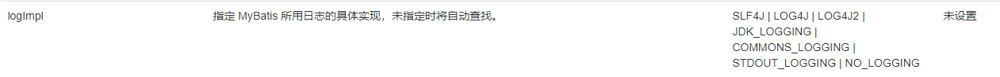

# Mybatis-9.28

>参考教程B站狂神：https://www.bilibili.com/video/BV1NE411Q7Nx

**环境**:

- JDK1.8
- Mysql 5.7
- maven 3.6.1
- IDEA

**基础**：

- JDBC
- Mysql
- Java基础
- Maven
- Junit

SS**M**框架：配置文件，最好的学习方式：看官方的文档

## 1、简介

### 1.1、什么是Mybatis


- MyBatis 是一款优秀的**持久层框架**，
- 它支持自定义 SQL、存储过程以及高级映射。
- MyBatis 免除了几乎所有的 JDBC 代码以及设置参数和获取结果集的工作。
- MyBatis 可以通过简单的 XML 或注解来配置和映射原始类型、接口和 Java POJO（Plain Old Java Objects，普通老式 Java 对象）为数据库中的记录。
- MyBatis 本是[apache](https://baike.baidu.com/item/apache/6265)的一个开源项目[iBatis](https://baike.baidu.com/item/iBatis), 2010年这个项目由apache software foundation 迁移到了google code，并且改名为MyBatis 。
- 2013年11月迁移到**Github**。

### 1.1如何获得Mybatis

- maven仓库：

  ```xml
  <!-- https://mvnrepository.com/artifact/org.mybatis/mybatis -->
  <dependency>
      <groupId>org.mybatis</groupId>
      <artifactId>mybatis</artifactId>
      <version>3.5.2</version>
  </dependency>
  ```

- GitHub：https://github.com/mybatis/mybatis-3

- 中文文档：https://mybatis.org/mybatis-3/zh/index.html

### 1.2、持久层

数据持久化

- 持久化就是将程序的数据在持久状态和瞬时状态转化的过程
- 内存：**断电即失**
- 数据库(Jdbc)，io文件持久化。
- 生活:冷藏.罐头。


### 1.3、持久层

Dao层，Service层，Controller层.....

- 完成持久化工作的代码块
- 层界限十分明显。

### 1.4、为什么需要Mybatis?

- 帮助程序猿将数据存入到数据库中。
- 方便
- 传统的JDBC代码太复杂了。简化。框架。自动化。
- 优点
  - 简单易学：
  - 灵活：
  - sql和代码的分离，提高了可维护性。
  - 提供映射标签，支持对象与数据库的orm字段关系映射
  - 提供对象关系映射标签，支持对象关系组建维护
  - 提供xml标签，支持编写动态sql。

### ORM框架（Object Relational Mapping）

-   编写程序的时候，一面向对象的方式处理数据
-   保存数据的时候，却以关系数据库的方式存储


**最重要的一点：使用的人多!**
Spring	SpringMVC	SpringBoot


## 2、第一个Mybatis程序

### 2.1、搭建环境

建立一个`mybatis`数据库用来使用，建立一张`user`表

```sql
CREATE DATABASE `mybatis`;

USE `mybatis`;

CREATE TABLE `user`(
  `id` INT(20) NOT NULL PRIMARY KEY,
  `name` VARCHAR(30) DEFAULT NULL,
  `pwd` VARCHAR(30) DEFAULT NULL
)ENGINE=INNODB DEFAULT CHARSET=utf8;

INSERT INTO `user`(`id`,`name`,`pwd`) VALUES 
(1,'狂神','123456'),
(2,'张三','123456'),
(3,'李四','123890')
```


新建一个Maven项目并导入相关依赖

 导入需要的依赖

```xml
<!--  导入依赖  -->
<dependencies>
    <!--mysql驱动-->
    <dependency>
        <groupId>mysql</groupId>
        <artifactId>mysql-connector-java</artifactId>
        <version>5.1.47</version>
    </dependency>
    <!--mybatis--><!-- https://mvnrepository.com/artifact/org.mybatis/mybatis -->
    <dependency>
        <groupId>org.mybatis</groupId>
        <artifactId>mybatis</artifactId>
        <version>3.5.2</version>
    </dependency>
    <!--junit-->
    <dependency>
        <groupId>junit</groupId>
        <artifactId>junit</artifactId>
        <version>4.12</version>
    </dependency>
</dependencies>
```


### 2.2、创建一个模块

1. 编写MyBatis的核心配置文件

   在**resources**文件夹下新建文件`mybatis-config.xml`

   ```xml
   <?xml version="1.0" encoding="UTF-8" ?>
   <!DOCTYPE configuration
       PUBLIC "-//mybatis.org//DTD Config 3.0//EN"
       "http://mybatis.org/dtd/mybatis-3-config.dtd">
   <!--configuration核心配置文件-->
   <configuration>
   
   <!--environments为复数，表示里面可以配置多个环境default表示选择这里面的其中一个环境的id，-->
   <environments default="development">
   
       <!--environment表示一个环境的开始，id是它的标志-->
       <environment id="development">
       <!--使用jdbc的事物管理-->
           <transactionManager type="JDBC"/>
           <!--里面这4个就是连接数据库要用的东西，把自己的数据库相关信息写进去就行-->
           <dataSource type="POOLED">
               <property name="driver" value="com.mysql.jdbc.Driver"/>
               <property name="url" value="jdbc:mysql://localhost:3306/mybatis?useUnicode=true&amp;characterEncoding=utf-8&amp;useSSL=false"/>
               <property name="username" value="数据库系统的用户名"/>
               <property name="password" value="数据库系统的密码"/>
           </dataSource>
       </environment>
   
   </environments>
   
   </configuration>
   ```

2. 编写mybatis工具类

   ```java
   public class MyBatisUtils {
   private static SqlSessionFactory sqlSessionFactory;
   
   static {
       try {
           //使用Mybatis第一步：获取sqlSessionFactory对象
           String resource = "mybatis-config.xml";
           InputStream inputStream = Resources.getResourceAsStream(resource);
           SqlSessionFactory sqlSessionFactory = new SqlSessionFactoryBuilder().build(inputStream);
       } catch (IOException e) {
           e.printStackTrace();
       }
   }
   //既然有了 SqlSessionFactory，顾名思义，我们可以从中获得 SqlSession 的实例。
   // SqlSession 提供了在数据库执行 SQL 命令所需的所有方法。你可以通过 SqlSession 实例来直接执行已映射的 SQL 语句。例如：
   
   public static SqlSession getSqlSession() {
       return sqlSessionFactory.openSession();
   }
   
   }
   ```

### 2.3、编写程序

**与数据库表相关的实体类**

然后照着数据库表把实体类写好就可以了（注意类的属性名和数据库表的列名要一致）

- entity

  ```java
  package com.ylw.pojo;
  
  //与数据库表对应的实体类
  public class User {
      private int id;
      private String name;
      private String pwd;
  
      public User() {
      }
  
      public User(int id, String name, String pwd) {
          this.id = id;
          this.name = name;
          this.pwd = pwd;
      }
  
      public int getId() {
          return id;
      }
  
      public void setId(int id) {
          this.id = id;
      }
  
      public String getName() {
          return name;
      }
  
      public void setName(String name) {
          this.name = name;
      }
  
      public String getPwd() {
          return pwd;
      }
  
      public void setPwd(String pwd) {
          this.pwd = pwd;
      }
  
      @Override
      public String toString() {
          return "User{" +
                  "id=" + id +
                  ", name='" + name + '\'' +
                  ", pwd='" + pwd + '\'' +
                  '}';
      }
  }
  ```

  

- Dao（Mapper）接口

  ```java
public interface UserDao {
      /**
       * 功能描述:获取所有用户信息
       * @param
       * @return java.util.List<com.tiamo.entity.User>
       * @auther LIU HAO DONG
       * @date 2020/7/29 19:09
       */
      List<User> getUserList();
  }
  ```
  
  

- 实现类（配置文件）

  接口实现类由原来的UserDaolmpl转变为一个Mapper配置文件

  ```xml
  <?xml version="1.0" encoding="UTF-8" ?>
  <!DOCTYPE mapper
          PUBLIC "-//mybatis.org//DTD Mapper 3.0//EN"
          "http://mybatis.org/dtd/mybatis-3-mapper.dtd">
  <!--namespace=绑定一个对应的Dao/Mapper接口-->
  <mapper namespace="com.tiamo.dao.UserDao">
      <!--select查询语句-->
      <select id="getUserList" resultType="com.tiamo.entity.User">
          select * from mybatis.user
      </select>
  </mapper>
  ```

### Mapper.xml配置文件

### 2.4、测试

核心配置文件中注册mappers

- **使用junit测试**

  目录结构：
  测试程序一般写在test目录下的绿色java包里

  

  测试的目录结构尽量和普通的目录结构对应

  

- 测试代码

  ```java
  import com.ylw.pojo.User;
  import com.ylw.utils.MyBatisUtils;
  import org.apache.ibatis.session.SqlSession;
  import org.junit.Test;
  
  import java.util.List;
  
  public class UserDaoTest {
  
      @Test
      public void test(){
          //通过写的MyBatisUtils类里的getSqlSession()方法，获取sqlSession对象
          SqlSession sqlSession = MyBatisUtils.getSqlSession();
          //执行SQL语句
          UserDao userDao = sqlSession.getMapper(UserDao.class);//通过UserDao接口，返回接口实现类信息
          List<User> userList = userDao.getUserList();//执行口实现类的方法，即配置文件里的id
          //输出结果
          for (User user : userList) {
              System.out.println(user);
          }
          //关闭sqlSession
          sqlSession.close();
  
      }
  }
  ```


可以能会遇到的问题:

1. 配置文件没有注册
2. 绑定接口错误
3. 方法名不对
4. 返回类型不对
5. Maven导出资源问题


### 测试中的错误

####  错误一：绑定异常

`org.apache.ibatis.binding.BindingException: Type interface com.ylw.dao.UserDao is not known to the MapperRegistry.`


**解决方法：**
在MyBatis核心配置文件中注册Mapper配置文件


但是由于Mapper配置文件不在resources目录下，会造成资源导出失败问题，造成下面的错误二


#### 错误二： java.lang.ExceptionInInitializerError


**产生问题的原因：**
maven由于他的约定大于配置，我们之后可以能遇到我们写的配置文件，无法被导出或者生效的问题。


**方法一**：治标不治本（不建议）


**方法二**：
在pom.xml中添加下面的代码

```xml
<!--在build中配置resources，来防止我们资源导出失败的问题-->
<build>
    <resources>
        <resource>
            <directory>src/main/resources</directory>
            <includes>
                <include>**/*.properties</include>
                <include>**/*.xml</include>
            </includes>
            <filtering>true</filtering>
        </resource>
        <resource>
            <directory>src/main/java</directory>
            <includes>
                <include>**/*.properties</include>
                <include>**/*.xml</include>
            </includes>
            <filtering>true</filtering>
        </resource>
    </resources>
</build>
```

注意：如果不行，就把`<filtering>true</filtering>`中true改为false或者注释掉（删除）

再次运行可以看到target中出现了Mapper配置文件


**方法三**：
直接将UserMapper.xml文件放到resources文件夹中，且在MyBatis核心配置文件的注册路径为resource="UserMapper.xml"就可以了，不用在pom.xml再加方法二的build配置了


### 总结，测试时正确的做法

**方法一**：直接将UserMapper.xml文件放到resources文件夹中，同时MyBatis核心配置文件的注册路径为路径为

resource="UserMapper.xml"就可以了，不用在pom.xml再加build配置


**方法二**：UserMapper.xml文件不放在resources文件夹中，而是放在java目录下，MyBatis核心配置文件的注册路径为

路径为resource=“包名路径/UserMapper.xml”，但是要在pom.xml中添加build配置，按照错误二，解决方法二的方式

进行


## 3、CRUD

### 一、总体步骤

1. 编写接口

2. 实现接口

3. 测试 （增删改需要提交事务）

4. ### 1、namespace

   namespace中的包名要和Dao/Mapper接口的包名一致

### 2、Select

选择查询语句；

- id：对应的namespace中的方法名
- resultType：Sql语句执行的返回值类型
- parameterType：参数类型

1. 编写接口	

   ```java
   //功能描述: 根据id查询用户
   User getUserById(int id);
   ```

2. 编写对应中的mapper中的sql语句

   ```xml
   <!--写一个查询语句-->
   <!--select表示查询，id对应要重写的方法名，resultType对应查询语句返回的结果类型-->
   <select id="getUserList" resultType="com.tiamo.entity.User">
       select * from mybatis.user
   </select>
   ```

3. 测试代码

   ```java
   @Test
   public void getUserById(){
       SqlSession sqlSession = MyBatisUtils.getSqlSession();
       UserMapper mapper = sqlSession.getMapper(UserMapper.class);
       User user = mapper.getUserById(1);
       System.out.println(user);
   
       sqlSession.close();
   }
   ```

### 3、insert

1. 编写接口

   ```java
   //功能描述:添加一个用户
   int addUser(User User);
   ```

2. 编写对应中的mapper中的sql语句

   ```xml
   <!--添加用户-->
   <!--注意#{}里的参数id,name,pwd是与实体类User里面的属性名对应的-->
   <insert id="addUser" parameterType="com.tiamo.entity.User">
       insert into mybatis.user (id ,name ,pwd) values (#{id},#{name},#{pwd});
   </insert>
   ```

3. 测试代码

   ```java
   //增删改，需要提交事务
   @Test
   public void addUser(){
       SqlSession sqlSession = MyBatisUtils.getSqlSession();
       UserMapper mapper = sqlSession.getMapper(UserMapper.class);
       int res = mapper.addUser(new User(4, "韩寒", "123123"));
       if (res>0){
           System.out.println("插入成功");
       }
       //提交事务
       sqlSession.commit();
       sqlSession.close();
   }
   ```

### 4、update

1. 编写接口

   ```java
   //功能描述:修改用户
   int updateUser(User user);
   ```

2. 编写对应中的mapper中的sql语句

   ```xml
   <!--修改用户-->
   <!--注意#{}里的参数id,name,pwd是与实体类User里面的属性名对应的-->
   <update id="updateUser" parameterType="com.tiamo.entity.User">
       update user set name = #{name },pwd=#{pwd} where id = #{id};
   </update>
   ```

3. 测试代码

   ```java
   @Test
   public void updateUser(){
       SqlSession sqlSession = MyBatisUtils.getSqlSession();
       UserMapper mapper = sqlSession.getMapper(UserMapper.class);
       mapper.updateUser(new User(4, "呵呵", "11111"));
   
       System.out.println();
       System.out.println();
       sqlSession.commit();
       sqlSession.close();
   }
   ```

### 5、delete

1. 编写接口

   ```java
   //功能描述: 删除一个用户
   int deleteUser(int id);
   ```

2. 编写对应中的mapper中的sql语句

   ```xml
   <!--删除用户-->
   <!--注意#{}里的参数id,name,pwd是与实体类User里面的属性名对应的-->
   <delete id="deleteUser" parameterType="int">
       delete from mybatis.user where id = #{id};
   </delete>
   ```

3. 测试代码

   ```java
   @Test
   public void deleteUser() {
       //通过写的MyBatisUtils类里的getSqlSession()方法，获取sqlSession对象
       SqlSession sqlSession = MyBatisUtils.getSqlSession();
       //执行SQL语句
       UserMapper mapper = sqlSession.getMapper(UserMapper.class);//UserMapper，返回接口实现类信息
       int res = mapper.deleteUser(4);//执行口实现类的方法，即配置文件里的id
       if (res > 0) {
           System.out.println("删除成功");
       }
       //提交事物
       sqlSession.commit();
       //关闭sqlSession
       sqlSession.close();
   }
   ```

   

### 6、错误分析

- 标签不要匹配错
- resource绑定mapper,需要使用路径!
- 程序配置文件必须符合规范!
- NullPointerException,没有注册到资源!
- 输出的xml文件中存在中文乱码问题!
- maven资源没有导出问题! 

### 7、万能Map

假设，我们的实体类，或者数据库中的表，字段或者参数过多，我们应当考虑使用Map!

```java
/**
 * 功能描述:使用Map添加一个用户
 * @param map
 * @return int
 * @auther LIU HAO DONG
 * @date 2020/7/31 17:51
 */
int addUser2(Map<String,Object> map);
```

```xml
<!--对象中的属性，可以直接取出来用     传递Map中的key-->
<insert id="addUser2" parameterType="map">
    insert into mybatis.user (id,pwd) values (#{userid},#{password});
</insert>
```

```java
@Test
public void addUser2() {
    //通过写的MyBatisUtils类里的getSqlSession()方法，获取sqlSession对象
    SqlSession sqlSession = MyBatisUtils.getSqlSession();
    //执行SQL语句
    UserMapper mapper = sqlSession.getMapper(UserMapper.class);//UserMapper，返回接口实现类信息
    //执行口实现类的方法，即配置文件里的id
    Map<String, Object> map = new HashMap<String, Object>();
    map.put("userid",5);
    map.put("password","222222");
    int res = mapper.addUser2(map);
    if (res > 0) { //插入成功的话，返回值一般是1
        System.out.println("插入成功");
    }
    //提交事务
    sqlSession.commit();
    //关闭sqlSession
    sqlSession.close();
}
```

Map传递参数,直接在sq|中取出key即可! 【parameterType="map"】

对象传递参数，直接在sq|中取对象的属性即可! 【parameterType="Object" 】

只有一-个基本类型参数的情况下，可以直接在sq|中取到!

多个参数用Map,或者**注解!**


### 8、使用Map进行模糊查询-模糊查询like

接口：

```java
//模糊查询
List<User> getUserLike(String name);
```

**Mapper配置文件**

注意配置文件里不要使用类似%的符号，可能会造成SQL注入问题

Java代码执行的时候，传递通配符%%

```java
List<User> users = mapper.getUserLike("李%");
```

```xml
<select id="getUserLike" resultType="com.tiamo.pojo.User">
    select * from mybatis.user where name like #{value}
</select>
```

在sql拼接中使用通配符

```sql
select * from mybatis.user where name like #{value}"%"
```

测试例子

```java
@Test
public void getUserLike(){
    SqlSession sqlSession = MyBatisUtils.getSqlSession();

    UserMapper mapper = sqlSession.getMapper(UserMapper.class);
    List<User> users = mapper.getUserLike("李%");
    for (User user : users) {
        System.out.println(user);
    }

    sqlSession.close();
}
```


## 4、配置解析

### 1、核心配置文件

- 官方推荐文件名称：`mybatis-config.xml`

- MyBatis 的配置文件包含了会深深影响 MyBatis 行为的设置和属性信息。

- 一些标签的意思：

  ```xml
  configuration（配置）
  properties（属性）
  settings（设置）
  typeAliases（类型别名）
  typeHandlers（类型处理器）
  objectFactory（对象工厂）
  plugins（插件）
  environments（环境配置）
  environment（环境变量）
  transactionManager（事务管理器）
  dataSource（数据源）
  databaseIdProvider（数据库厂商标识）
  mappers（映射器）
  ```

### 2、环境配置（environments）

MyBatis 可以配置成适应多种环境

**不过要记住：尽管可以配置多个环境，但每个 SqlSessionFactory 实例只能选择一种环境。**

####  **environments和environment**

下面的environments 标签里包含了两个environment ，一个id是`development`，一个id是`test`，但是environments 只能选择一个`environment `，如图environments 的default属性的值，就对应选中的environment 的id的值

```xml
<?xml version="1.0" encoding="UTF-8" ?>
<!DOCTYPE configuration
        PUBLIC "-//mybatis.org//DTD Config 3.0//EN"
        "http://mybatis.org/dtd/mybatis-3-config.dtd">
<!--configuration核心配置文件-->
<configuration>

    <!--environments为复数，表示里面可以配置多个环境default表示选择这里面的其中一个环境的id，-->
    <environments default="development">

        <!--environment表示一个环境的开始，id是它的标志-->
        <environment id="development">
        <!--使用jdbc的事物管理-->
            <transactionManager type="JDBC"/>
            <!--里面这4个就是连接数据库要用的东西，把自己的数据库相关信息写进去就行-->
            <dataSource type="POOLED">
                <property name="driver" value="com.mysql.jdbc.Driver"/>
                <property name="url" value="jdbc:mysql://localhost:3306/mybatis?useUnicode=true&amp;characterEncoding=utf-8&amp;useSSL=false"/>
                <property name="username" value="root"/>
                <property name="password" value="root"/>
            </dataSource>
        </environment>

        <!--environment表示一个环境的开始，id是它的标志-->
        <environment id="test">
            <transactionManager type="JDBC"/>
            <dataSource type="POOLED">
                <property name="driver" value="com.mysql.jdbc.Driver"/>
                <property name="url" value="jdbc:mysql://localhost:3306/mybatis?useUnicode=true&amp;characterEncoding=utf-8&amp;useSSL=false"/>
                <property name="username" value="root"/>
                <property name="password" value="root"/>
            </dataSource>
        </environment>

    </environments>

    <!--每一个Mapper.xml都需要在MyBatis核心配置文件中注册-->
    <!--mappers复数表示可以配置多个-->
    <mappers>
        <mapper resource="com/ylw/dao/UserMapper.xml"/>

    </mappers>

</configuration>
```


#### transactionManager

基本上只使用jdbc类型的


#### dataSource

基本上都是用POOLED类型有连接池的


### 3、属性（properties）

我们可以通过properties属性来实现引用配置文件

这些属性都是可外部配置且可动态替换的，既可以在典型的 Java 属性文件中配置，亦可通过 properties 元素的子元素来传递。

#### 示例

编写一个数据库配置文件`db.properties`

```properties
driver=com.mysql.jdbc.Driver
url=jdbc:mysql://localhost:3306/mybatis?useUnicode=true&characterEncoding=utf-8&useSSL=false
username=root
password=123456
```


在mybatis核心配置文件`mybatis-config.xml`中引入数据库配置文件`db.properties`，所以properties只能放在最上面


#### 方式一、在引用的时候，可以只写一个resource路径，然后在value里使用${对应的名称}就行

```xml
<!--这里用一个自闭和标签，只要写一个resource就行了-->
<properties resource="db.properties"/>

<!--environment表示一个环境的开始，id是它的标志-->
<environment id="test">
    <transactionManager type="JDBC"/>
    <dataSource type="POOLED">
        <property name="driver" value="${driver}"/>
        <property name="url" value="${url}"/>
        <property name="username" value="${username}"/>
        <property name="password" value="${password}"/>
    </dataSource>
</environment>
```


#### 方式二、在引用的时候，也可以设置一些值


但是，如果和外部配置文件有冲突的时候，会优先使用外部配置文件的配置，优先读取在`properties`元素体内指定的属性


### 4、类型别名（typeAliases）

- 类型别名可为 Java 类型设置一个缩写名字

- 意在降低冗余的全限定类名书写

  

  

#### 第一种typeAlias方法

如图在MyBatis核心配置文件中添加别名如下，注意标签顺序


然后在使用到com. ylw.pojo.User时，就可以使用User代替


#### 第二种package方法

指定包名的方法：扫描实体类的包，它的默认别名就为这个类的类名，首字母小写


大小写都可以，但是建议小写


- 在实体类比较少的时候，使用第一种方式。
- 如果实体类十分多，建议使用第二种。
- 第一种可以DIY别名，第二种则不行，如果非要改，需要在实体上增加注解

#### 注解

注意，注解和package要一起使用


在实体类里添加注解，就使用注解的别名


#### Java 类型内建的类型别名

下面是一些为常见的 Java 类型内建的类型别名。它们都是不区分大小写的，注意，为了应对原始类型的命名重复，采取了特殊的命名风格。

| 别名       | 映射的类型 |
| ---------- | ---------- |
| _byte      | byte       |
| _long      | long       |
| _short     | short      |
| _int       | int        |
| _integer   | int        |
| _double    | double     |
| _float     | float      |
| _boolean   | boolean    |
| string     | String     |
| byte       | Byte       |
| long       | Long       |
| short      | Short      |
| int        | Integer    |
| integer    | Integer    |
| double     | Double     |
| float      | Float      |
| boolean    | Boolean    |
| date       | Date       |
| decimal    | BigDecimal |
| bigdecimal | BigDecimal |
| object     | Object     |
| map        | Map        |
| hashmap    | HashMap    |
| list       | List       |
| arraylist  | ArrayList  |
| collection | Collection |
| iterator   | Iterator   |


## 5、设置（settings）

这是 MyBatis 中极为重要的调整设置，它们会改变 MyBatis 的运行时行为。 下表描述了设置中各项设置的含义、默认值等。

| **设置名**                 | **描述**                                                     | **有效值**                                                   | **默认值**** |
| -------------------------- | ------------------------------------------------------------ | ------------------------------------------------------------ | ------------ |
| cacheEnabled(缓存是否开启) | 全局性地开启或关闭所有映射器配置文件中已配置的任何缓存。     | true\|false                                                  | true         |
| lazyLoadingEnabled(懒加载) | 延迟加载的全局开关。当开启时，所有关联对象都会延迟加载。 特定关联关系中可通过设置 `fetchType` 属性来覆盖该项的开关状态。 | true\|false                                                  | false        |
| useGeneratedKeys           | 允许 JDBC 支持自动生成主键，需要数据库驱动支持。如果设置为 true，将强制使用自动生成主键。尽管一些数据库驱动不支持此特性，但仍可正常工作（如 Derby）。 | true\|false                                                  | False        |
| mapUnderscoreToCamelCase   | 是否开启驼峰命名自动映射，即从经典数据库列名 A_COLUMN 映射到经典 Java 属性名 aColumn。 | true\|false                                                  | false        |
| logImpl                    | 指定 MyBatis 所用日志的具体实现，未指定时将自动查找。        | SLF4J \| LOG4J \| LOG4J2 \| JDK_LOGGING \| COMMONS_LOGGING    \|STDOUT_LOGGING   \|NO_LOGGING | 未设置       |

- 
- 


## 6、其他配置

不重要的一些配置

- typeHandlers（类型处理器
- objectFactory（对象工厂）
- 常用plugins插件
  - [mybatis-generator-core](https://mvnrepository.com/artifact/org.mybatis.generator/mybatis-generator-core)
  - [mybatis-plus](https://mvnrepository.com/artifact/com.baomidou/mybatis-plus)
  - 通用mapper


## 7、映射器（mappers）

`MapperRegistry`：注册绑定我们的Mapper配置文件；

### 方式一： resource【推荐使用】

```xml
<!--每一个Mapper.XML都需要在Mybatis核心配置文件中注册！-->
<mappers>
    <mapper resource="com/ylw/dao/UserMapper.xml"/>
</mappers>
```

### 方式二：使用class文件绑定注册

```xml
<!--每一个Mapper.XML都需要在Mybatis核心配置文件中注册！-->
<mappers>
    <mapper class="com.ylw.dao.UserMapper"/>
</mappers>
```

注意点：

- 接口和他的Mapper配置文件必须同名！
- 接口和他的Mapper配置文件必须在同一个包下！

### 方式三：使用扫描包进行注入绑定

```xml
<!--每一个Mapper.XML都需要在Mybatis核心配置文件中注册！-->
<mappers>
    <package name="com.kuang.dao"/>
</mappers>
```

注意点：

- 接口和他的Mapper配置文件必须同名！
- 接口和他的Mapper配置文件必须在同一个包下！

不推荐使用：


## 8、生命周期和作用域


生命周期，和作用域，是至关重要的，因为错误的使用会导致非常严重的**并发问题**。

**SqlSessionFactoryBuilder：**

- 一旦创建了 SqlSessionFactory，就不再需要它了
- 局部变量

**SqlSessionFactory：**

- 可以想象为 ：数据库连接池
- SqlSessionFactory 一旦被创建就应该在应用的运行期间一直存在，**没有任何理由丢弃它或重新创建另一个实例。**
- 因此 SqlSessionFactory 的最佳作用域是应用作用域。
- 最简单的就是使用**单例模式**或者静态单例模式。

**SqlSession**

- 连接到连接池的一个请求！
- SqlSession 的实例不是线程安全的，因此是不能被共享的，所以它的最佳的作用域是请求或方法作用域。
- 用完之后需要赶紧关闭，否则资源被占用！


这里面的每一个Mapper，就代表一个具体的业务！


## 5、resultMap结果集映射

### 1、属性名和字段名不一致的情况


运行测试发现，数据库表中pwd对应的值查不出来


### 原因


类型处理器把这句话转化成了下面这句话

```sql
select id,name,pwd from mybatis.user where id = #{id}
```

### 解决方法

#### 方法一，改写SQL语句，起别名

改为如下所示，加一个as

```sql
select id,name,pwd as password from mybatis.user where id = #{id}
```

#### 方法二，resultMap结果集映射


改为，其实只要映射不一样的字段就行，type对应原来resultType的值


- 官方的一些解释

- `resultMap` 元素是 MyBatis 中最重要最强大的元素
- resultMap的设计思想是，对于简单的语句根本不需要配置显式的结果映射，而对于复杂一点的语句只需要描述它们的关系就行了。
- `resultMap` 最优秀的地方在于，虽然你已经对它相当了解了，但是根本就不需要显式地用到他们。

## 6、日志工厂

如果一个数据库操作，出现了异常，我们需要排错。日志就是最好的助手！
以前可以通过输出和调试来差错
现在可以使用：日志工厂！


- 值

- SLF4J
- LOG4J【重要】【掌握】
- LOG4J2
- JDK_LOGGING java自带的日志输出
- COMMONS_LOGGING 工具包
- STDOUT_LOGGING【重要】【掌握】控制台输出
- NO_LOGGING 没有日志输出

在Mybatis中具体使用哪一个日志实现，在设置中设定！
**STDOUT_LOGGING标准日志输出**
在mybatis核心配置文件中，配置我们的日志！（注意settings标签的位置）
注意一个引号里一个空格都不能多，大小写也必须完全一致

```xml
<settings>
    <!--配置日志-->
    <setting name="logImpl" value="STDOUT_LOGGING"/>
</settings>
```

输出解析


### LOG4J

#### 什么是LOG4J？

- LOG4J是[Apache](https://baike.baidu.com/item/Apache/8512995)的一个开源项目，通过使用Log4j，我们可以控制日志信息输送的目的地是[控制台](https://baike.baidu.com/item/控制台/2438626)、文件、[GUI](https://baike.baidu.com/item/GUI)组件
- 我们也可以控制每一条日志的输出格式；
- 通过定义每一条日志信息的级别，我们能够更加细致地控制日志的生成过程。
- 通过一个[配置文件](https://baike.baidu.com/item/配置文件/286550)来灵活地进行配置，而不需要修改应用的代码。

#### LOG4J导包

[官网maven依赖](https://mvnrepository.com/artifact/log4j/log4j/1.2.17)

```xml
<!-- https://mvnrepository.com/artifact/log4j/log4j -->
<dependency>
    <groupId>log4j</groupId>
    <artifactId>log4j</artifactId>
    <version>1.2.17</version>
</dependency>
```

#### LOG4J配置文件

导完包之后，新建一个配置文件`log4j.properties`


内容：

```properties
#将等级为DEBUG的日志信息输出到console和file这两个目的地，console和file的定义在下面的代码
log4j.rootLogger=DEBUG,console,file

#控制台输出的相关设置
log4j.appender.console = org.apache.log4j.ConsoleAppender
log4j.appender.console.Target = System.out
log4j.appender.console.Threshold=DEBUG
log4j.appender.console.layout = org.apache.log4j.PatternLayout
log4j.appender.console.layout.ConversionPattern=[%c]-%m%n

#文件输出的相关设置
log4j.appender.file = org.apache.log4j.RollingFileAppender
log4j.appender.file.File=./log/tiamo.log
log4j.appender.file.MaxFileSize=10mb
log4j.appender.file.Threshold=DEBUG
log4j.appender.file.layout=org.apache.log4j.PatternLayout
log4j.appender.file.layout.ConversionPattern=[%p][%d{yy-MM-dd}][%c]%m%n

#日志输出级别
log4j.logger.org.mybatis=DEBUG
log4j.logger.java.sql=DEBUG
log4j.logger.java.sql.Statement=DEBUG
log4j.logger.java.sql.ResultSet=DEBUG
log4j.logger.java.sql.PreparedStatement=DEBUG
```


注意这是文件输出路径


#### 在MyBatis核心配置文件中设置输出日志为LOG4J

```xml
<settings>
    <!--配置日志-->
    <setting name="logImpl" value="LOG4J"/>
</settings>
```

配置完成后就可以使用了

#### 其他简单使用方法

1. 在类中使用：导入包`import org.apache.log4j.Logger`;	

2. 注意不到导入错了，java有个自带的`logger`
   获取日志对象，参数为当前类`.class`

   ```java
   static Logger logger = Logger.getLogger(UserDaoTest.class);
   ```

   

3. 使用不同级别的输出来代替System.out.println();

   


## 7、**分页**

为什么要分页？

- 减少数据的处理量

### 7.1、使用sql分页方法limit 关键字

下标从0开始，pagesize>0时表示是每页的数量

```sql
语法：SELECT * from user limit startIndex,pageSize;
例如：SELECT * from user limit 3;  #[0,n]
```

**使用MyBatis实现分页**

接口

```java
//分页
List<User> getUserByLimit(Map<String,Integer> map);
```

Mapper.xml配置文件

```xml
<!--分页-->
<select id="getUserByLimit" parameterType="map" resultType="user">
    select * from user limit #{starIndex},#{pagesize};
</select>
```

测试

```java
@Test
public void getUserByLimit(){
    SqlSession sqlSession = MyBatisUtils.getSqlSession();
    UserMapper mapper = sqlSession.getMapper(UserMapper.class);
    Map<String, Integer> map = new HashMap<String, Integer>();
    map.put("starIndex",0);
    map.put("pagesize",2);
    List<User> userList = mapper.getUserByLimit(map);
    for (User user : userList) {
        System.out.println(user);
    }

    sqlSession.close();
}
```

### 7.2、通过RowBounds分页(不常用)

即面向对象，不在Mapper配置文件中通过sql语句进行分页，而是在方法里去实现，而且在方法里还要使用MyBatis官方不推荐使用的方法

接口：

```java
//分页:通过RowBounds分页
List<User> getUserByRowBounds();
```

Mapper.xml配置文件

```xml
<!--分页:通过RowBounds分页-->
<select id="getUserByRowBounds" resultType="user">
    select * from user
</select>
```

测试

```java
@Test
public void getUserByRowBounds(){
    SqlSession sqlSession = MyBatisUtils.getSqlSession();
    //通过RowBounds实现分页
    RowBounds rowBounds = new RowBounds(1,2);

    //通过Java代码层面实现分页
    List<User> userList = sqlSession.selectList("com.tiamo.dao.UserMapper.getUserByRowBounds",null,rowBounds);
    for (User user : userList) {
        System.out.println(user);
    }

    sqlSession.close();
}
```

### 7.3、分页插件mybatis pagehelper

官网：https://pagehelper.github.io/

官方使用文档：https://pagehelper.github.io/docs/howtouse/


## 8、使用注解开发

### 8.1、面向接口编程

- 大家之前都学过面向对象编程,也学习过接口，但在真正的开发中，很多时候我们会选择面向接口编程

  **根本原因:解耦,可拓展,提高复用,分层开发中,上层不用管具体的实现,大家都遵守共同的标准,使得开发变**
  **得容易,规范性更好**

- 在一一个面向对象的系统中，系统的各种功能是由许许多多的不同对象协作完成的。在这种情况下，各个对象内部

- 是如何实现自己的，对系统设计人员来讲就不那么重要了;

- 而各个对象之间的协作关系则成为系统设计的关键。小到不同类之间的通信，大到各模块之间的交互，在系统设

- 计之初都是要着重考虑的，这也是系统设计的主要工作内容。面向接口编程就是指按照这种思想来编程。


#### **关于接口的理解**

- 接口从更深层次的理解，应是定义(规范,约束)与实现(名实分离的原则)的分离。
- 接口的本身反映了系统设计人员对系统的抽象理解。
- 接口应有两类:第一类是对一个个体的抽象，它可对应为-个抽象体(abstract class);
- 第二类是对一个个体某-方面的抽象，即形成-一个抽象面(interface) ;
- 个体有可能有多个抽象面。抽象体与抽象面是有区别的。


#### 三个面向区别

- 面向对象是指，我们考虑问题时，以对象为单位,考虑它的属性及方法.
- 面向过程是指，我们考虑问题时，以一个具体的流程(事务过程)为单位,考虑它的实现.
- 接口设计与非接口设计是针对复用技术而言的，与面向对象(过程)不是一一个问题.更多的体现就是对系统整体的架构.

### 8.2使用注解开发的步骤

 一、写接口

注解写在接口上面，括号里是SQL语句

```java
public interface UserMapper {

    @Select("select * from user")
    List<User> getUser();

}
```

二、在mybatis核心配置文件中绑定接口

```xml
<!--绑定接口-->
<mappers>
    <mapper class="com.tiamo.dao.UserMapper"/>
</mappers>
```

三、测试

```java
@Test
public void getUser(){
    SqlSession sqlSession = MyBatisUtils.getSqlSession();
    UserMapper mapper = sqlSession.getMapper(UserMapper.class);
    List<User> users = mapper.getUser();
    for (User user : users) {
        System.out.println(user);
    }
    sqlSession.close();
}
```

官方推荐，复杂的语句不要使用注解


**本质**：反射机制实现
**底层**：动态代理！


Mybatis详细的执行流程


反射

java反射机制是在运行状态中，对于任何一个类，都能够知道这个类的所有属性和方法；对于任何一个对象，都能调用它的任意方法和属性；这种动态获取信息以及调用对象的功能成为Java语言的反射机制


### 8.3、使用注解实现CRUD增删改查

我们可以在工具类创建的时候实现自动提交事务！

```java
public static SqlSession  getSqlSession(){
    return sqlSessionFactory.openSession(true);
}
```


接口

```java
package com.ylw.dao;

import com.ylw.pojo.User;
import org.apache.ibatis.annotations.*;

import java.util.List;
import java.util.Map;

public interface UserMapper {

    //获取全部用户
    @Select("select * from mybatis.user")
    List<User> getUsers();

    //方法存在多个参数时，所有的参数必须加上@Param()，SQL语句中的参数名对应的是@Param()里的参数名
    @Select("select * from user where id = #{id} and name = #{name}")
    User getUserByID(@Param("id") int id,@Param("name") String name);

    @Insert("insert into user(id,name,pwd) values (#{id},#{name},#{password})")
    int addUser(User user);

    @Update("update user set name=#{name},pwd=#{password} where id = #{id}")
    int updateUser(User user);

    //SQL语句中的参数名对应的是@Param()里的参数名
    @Delete("delete from user where id = #{uid}")
    int deleteUser(@Param("uid") int id);

}
```

在mybatis核心配置文件中绑定接口

```xml
<!--绑定接口-->
<mappers>
    <mapper class="com.tiamo.dao.UserMapper"/>
</mappers>
```

测试

```java
import com.ylw.dao.UserMapper;
import com.ylw.pojo.User;
import com.ylw.utils.MyBatisUtils;
import org.apache.ibatis.session.SqlSession;
import org.junit.Test;

import java.util.List;

public class UserMapperTest {

    @Test
    public void test(){
        SqlSession sqlSession = MyBatisUtils.getSqlSession();
        UserMapper mapper = sqlSession.getMapper(UserMapper.class);

        //查找全部
//        List<User> users = mapper.getUsers();
//        for (User user : users) {
//            System.out.println(user);
//        }

        //根据id查找
//        User userByID = mapper.getUserByID(1,"张三");
//        System.out.println(userByID);

        //添加用户
//        mapper.addUser(new User(4, "Hello","123456"));

        //更新
//        mapper.updateUser(new User(4,"赵四","123456"));

        //删除
        mapper.deleteUser(4);

        sqlSession.close();
    }
}
```

**【注意:我们必须要将接口，注册绑定到我们的核心配置文件中! 】**

## 关于@Param() 注解

- 基本类型的参数或者String类型，需要加上
- 引用类型不需要加
- 如果只有一个基本类型的话，可以忽略，但是建议大家都加上！
- 我们在SQL中引用的就是我们这里的 @Param() 中设定的属性名！


## 9、LomBok


### 什么是Lombok

>Project Lombok is a java library that automatically plugs into your editor and build tools, spicing up your java.
>Never write another getter or equals method again, with one annotation your class has a fully featured builder, Automate your logging variables, and much more.

译文

>Lombok项目是一个Java库，它会自动插入您的编辑器和构建工具中，从而使您的Java更加生动有趣。
>永远不要再编写另一个getter或equals方法，带有一个注释的您的类有一个功能全面的生成器，自动化您的日志记录变量等等。

### 使用方法

1. 在IDEA2020.1中安装Lombok插件

   

   

2. 在IDEA中导入Lombok的jar包

   maven依赖 https://mvnrepository.com/artifact/org.projectlombok/lombok

   在pom.xml文件中添加依赖

   ```xml
   <!-- https://mvnrepository.com/artifact/org.projectlombok/lombok -->
   <dependency>
       <groupId>org.projectlombok</groupId>
       <artifactId>lombok</artifactId>
       <version>1.18.12</version>
       <scope>provided</scope>
   </dependency>
   ```

### 可供使用的注解

```java
@Getter and @Setter
@FieldNameConstants
@ToString
@EqualsAndHashCode
@AllArgsConstructor, @RequiredArgsConstructor and @NoArgsConstructor
@Log, @Log4j, @Log4j2, @Slf4j, @XSlf4j, @CommonsLog, @JBossLog, @Flogger
@Data
@Builder
@Singular
@Delegate
@Value
@Accessors
@Wither
@SneakyThrows
```

### 常用的Lombok注解

```java
@Data 生成无参构造，get、set、tostring、hashcode，equals
@AllArgsConstructor 生成有参构造
@NoArgsConstructor 生成无参构造
@EqualsAndHashCode 生成Equals和HashCode相关的方法
@ToString 生成tostring方法
@Getter
```

### 使用示例

可以看得到下面的实体类中有get、set、构造方法等


可以使用注解来代替这些代码


## 10 、 多对一处理

### 多对一关系


- 多个学生，对应一个老师
- 对于学生这边而言， **关联** … 多个学生，关联一个老师 【多对一】
- 对于老师而言， **集合** ， 一个老师，有很多学生 【一对多】


- ### 创建一个多对一的表

  ```sql
  CREATE TABLE `teacher` (
    `id` INT(10) NOT NULL,
    `name` VARCHAR(30) DEFAULT NULL,
    PRIMARY KEY (`id`)
  ) ENGINE=INNODB DEFAULT CHARSET=utf8;
  
  INSERT INTO teacher(`id`, `name`) VALUES (1, '秦老师'); 
  
  CREATE TABLE `student` (
    `id` INT(10) NOT NULL,
    `name` VARCHAR(30) DEFAULT NULL,
    `tid` INT(10) DEFAULT NULL,
    PRIMARY KEY (`id`),
    KEY `fktid` (`tid`),
    CONSTRAINT `fktid` FOREIGN KEY (`tid`) REFERENCES `teacher` (`id`)
  ) ENGINE=INNODB DEFAULT CHARSET=utf8;
  
  
  INSERT INTO `student` (`id`, `name`, `tid`) VALUES ('1', '小明', '1'); 
  INSERT INTO `student` (`id`, `name`, `tid`) VALUES ('2', '小红', '1'); 
  INSERT INTO `student` (`id`, `name`, `tid`) VALUES ('3', '小张', '1'); 
  INSERT INTO `student` (`id`, `name`, `tid`) VALUES ('4', '小李', '1'); 
  INSERT INTO `student` (`id`, `name`, `tid`) VALUES ('5', '小王', '1');
  ```

  

### 测试环境搭建

1. 导入lombok

2. 新建实体类Teacher, Student

   注：此处`entity`使用了**Lombok**

   ```java
   package com.tiamo.entity;
   import lombok.Data;
   import java.io.Serializable;
   
   /**
    * (Teacher)实体类
    *
    * @author makejava
    * @since 2020-08-03 01:35:47
    */
   @Data
   public class Teacher implements Serializable {
       private Integer id;
       private String name;
   }
   ```

   ```java
   package com.tiamo.entity;
   
   import lombok.Data;
   import java.io.Serializable;
   
   /**
    * (Student)实体类
    *
    * @author makejava
    * @since 2020-08-03 01:35:01
    */
   @Data
   public class Student implements Serializable {
       private Integer id;
       private String name;
       //学生需要关联一个老师
       private Teacher teacher;
   }
   ```

   

3. 建立Mapper接口

   

4. 建立Mapper.XML文件

   

   

5. 在核心配置文件中绑定注册我们的Mapper接口或者文件! 【方式很多, 随心选】

   

6. 测试查询是否能够成功!

   ```java
   @Test
   public void TeacherMapperTest() {
       SqlSession sqlSession = MyBatisUtils.getSqlSession();
       TeacherMapper mapper = sqlSession.getMapper(TeacherMapper.class);
       Teacher teacher = mapper.getTeacher(1);
       System.out.println(teacher);
       sqlSession.close();
   }
   ```


### 按照结果嵌套处理（联表查询）

StudentMapper.xml配置文件

```xml
<!--按照结果嵌套处理-->
<select id="getStudent2" resultMap="StudentTeacher2">
    select s.id sid,s.name sname,t.name tname
    from student s,teacher t
    where s.tid = t.id;
</select>

<resultMap id="StudentTeacher2" type="com.ylw.pojo.Student">
    <result property="id" column="sid"/>
    <result property="name" column="sname"/>
    <association property="teacher" javaType="com.ylw.pojo.Teacher">
        <result property="name" column="tname"/>
    </association>
</resultMap>
```

测试

```java
@Test
public void testStudent(){
    SqlSession sqlSession = MyBatisUtils.getSqlSession();
    StudentMapper studentMapper = sqlSession.getMapper(StudentMapper.class);
    List<Student> studentList = studentMapper.getStudent2();

    for (Student student : studentList) {
        System.out.println(student);
    }

    sqlSession.close();
}
```

## 11、一对多处理

比如：一个老师拥有多个学生！

对于老师而言，就是一对多的关系!


环境搭建：

1. 导入lombok

2. 修改实体类Teacher, Student

   ```java
   package com.tiamo.entity;
   
   import lombok.Data;
   
   import java.io.Serializable;
   
   /**
    * (Student)实体类
    *
    * @author makejava
    * @since 2020-08-03 01:35:01
    */
   @Data
   public class Student implements Serializable {
       private Integer id;
       private String name;
       private int tid;
   
   }
   ```

   ```java
   package com.tiamo.entity;
   
   import lombok.Data;
   
   import java.io.Serializable;
   import java.util.List;
   
   /**
    * (Teacher)实体类
    *
    * @author makejava
    * @since 2020-08-03 01:35:47
    */
   @Data
   public class Teacher implements Serializable {
   
       private Integer id;
       private String name;
       //一个老师拥有多个学生
       private List<Student> students;
   
   }
   ```

3. 其余步骤和刚才一样

### 按照查询嵌套处理（子查询）

接口

```java
Teacher getTeacher2(@Param("tid") int id);
```

TeacherMapper.xml配置文件

```xml
<!--按照查询嵌套处理-->
<select id="getTeacher2" resultMap="TeacherStudent2">
    select * from mybatis.teacher where id = #{tid}
</select>

<resultMap id="TeacherStudent2" type="com.ylw.pojo.Teacher">
    <collection property="students" javaType="ArrayList" ofType="com.ylw.pojo.Student" select="getStudentByTeacherId" column="id"/>
</resultMap>

<select id="getStudentByTeacherId" resultType="com.ylw.pojo.Student">
    select * from mybatis.student where tid = #{tid}
</select>
```

测试

```java
@Test
public void test(){
    SqlSession sqlSession = MyBatisUtils.getSqlSession();
    TeacherMapper mapper = sqlSession.getMapper(TeacherMapper.class);
    Teacher teacher = mapper.getTeacher2(1);

    System.out.println(teacher);

    sqlSession.close();
}

```

### 按照结果嵌套处理（联表查询）

[sql]:asd

接口

```java
//获取指定老师下的所有学生及老师的信息
Teacher getTeacher(@Param("tid") int id);
```

TeacherMapper.xml配置文件

```xml
<!--按结果嵌套查询-->
<select id="getTeacher" resultMap="TeacherStudent">
    select s.id sid, s.name sname, t.name tname,t.id tid
    from student s,teacher t
    where s.tid = t.id and t.id = #{tid}
</select>
<resultMap id="TeacherStudent" type="Teacher">
    <result property="id" column="tid"/>
    <result property="name" column="tname"/>
    <!--复杂的属性，我们需要单独处理 对象： association 集合： collection
    javaType="" 指定属性的类型！
    集合中的泛型信息，我们使用ofType获取
    -->
    <collection property="students" ofType="Student">
        <result property="id" column="sid"/>
        <result property="name" column="sname"/>
        <result property="tid" column="tid"/>
    </collection>
</resultMap>
```

测试

```java
@Test
public void getTeacher2Test(){
    SqlSession sqlSession = MyBatisUtils.getSqlSession();
    TeacherMapper mapper = sqlSession.getMapper(TeacherMapper.class);
    Teacher mapperTeacher = mapper.getTeacher2(1);
    System.out.println(mapperTeacher);
    sqlSession.close();
}
```

### 小结

1. 关联 - association 【多对一】
2. 集合 - collection 【一对多】
3. javaType & ofType
   1. JavaType 用来指定实体类中属性的类型
   2. ofType 用来指定映射到List或者集合中的 pojo类型，泛型中的约束类型！

注意点：

- 保证SQL的可读性，尽量保证通俗易懂
- 注意一对多和多对一中，属性名和字段的问题！
- 如果问题不好排查错误，可以使用日志 ， 建议使用 Log4j


## **面试高频**

- Mysq引擎
- InnoDB底层原理
- 索引
- 索引优化!

## 12、**动态 SQL常用标签**

什么是动态SQL

**什么是动态SQL：动态SQL就是指根据不同的条件生成不同的SQL语句**

> 动态 SQL 元素和 JSTL 或基于类似 XML 的文本处理器相似。在 MyBatis 之前的版本中，有很多元素需要花时间了解。MyBatis 3 大大精简了元素种类，现在只需学习原来一半的元素便可。MyBatis 采用功能强大的基于 OGNL 的表达式来淘汰其它大部分元素。

> 关键字
> if
> choose (when, otherwise)
> trim (where, set)
> foreach

搭建测试环境

建表

```sql
CREATE TABLE `blog` (
  `id` varchar(50) NOT NULL COMMENT '博客id',
  `title` varchar(100) NOT NULL COMMENT '博客标题',
  `author` varchar(30) NOT NULL COMMENT '博客作者',
  `create_time` datetime NOT NULL COMMENT '创建时间',
  `views` int(30) NOT NULL COMMENT '浏览量'
) ENGINE=InnoDB DEFAULT CHARSET=utf8
```

创建一个基础工程

### 用来随机生成ID的工具类

```java
import lombok.AllArgsConstructor;
import org.junit.Test;

import java.util.UUID;

/**
 * @ClassName IDUtils
 * @Description TODO
 * @Author LiuHaoDong
 * @Date 2020/8/4 0:12
 * @Version V1.0
 **/
public class IDUtils {

    //随机生成id，并把-替换成空
    public static String getID(){
        return UUID.randomUUID().toString().replaceAll("-","");
    }

    @Test
    public void test(){
        System.out.println(IDUtils.getID());
    }
}
```


1. 导包

2. 编写配置文件

   MyBatis核心配置文件

   设置开启驼峰命名转换规则

   ```xml
   <settings>
       <!--配置日志-->
       <setting name="logImpl" value="STDOUT_LOGGING"/>
       <!--开启驼峰命名转换-->
       <setting name="mapUnderscoreToCamelCase" value="true"/>
   </settings>
   ```

   

3. 编写实体类

   ```java
   import java.util.Date;
   
   /**
    * (Blog)实体类
    *
    * @author makejava
    * @since 2020-08-03 23:56:50
    */
   public class Blog {
       /**
        * 博客id
        */
       private String id;
       /**
        * 博客标题
        */
       private String title;
       /**
        * 博客作者
        */
       private String author;
       /**
        * 创建时间
        */
       private Date createTime;
       /**
        * 浏览量
        */
       private Integer views;
   
   
       public String getId() {
           return id;
       }
   
       public void setId(String id) {
           this.id = id;
       }
   
       public String getTitle() {
           return title;
       }
   
       public void setTitle(String title) {
           this.title = title;
       }
   
       public String getAuthor() {
           return author;
       }
   
       public void setAuthor(String author) {
           this.author = author;
       }
   
       public Date getCreateTime() {
           return createTime;
       }
   
       public void setCreateTime(Date createTime) {
           this.createTime = createTime;
       }
   
       public Integer getViews() {
           return views;
       }
   
       public void setViews(Integer views) {
           this.views = views;
       }
   }
   ```

### if

接口

```java
/**
 * 功能描述: 查询博客
 * @param map
 * @return java.util.List<com.tiamo.entity.Blog>
 */
List<Blog> queryBlogIF(Map map);
```

mapper.xml配置文件

```xml
<!--这里写where是为了便于后面的if拼接，并且当if都不符合的时候也可以确保查询语句正确,还可以写where标签-->
<select id="queryBlogIF" parameterType="map" resultType="blog">
    select * from blog where 1=1
    <if test="title != null">
        and title = #{title}
    </if>
    <if test="author != null">
        and author = #{author}
    </if>
</select>
```

测试类

```java
@Test
public void queryBlogIF(){
    SqlSession sqlSession = MyBatisUtils.getSqlSession();
    BlogMapper mapper = sqlSession.getMapper(BlogMapper.class);

    HashMap map = new HashMap();
    map.put("title","Java如此简单");
    List<Blog> blogs = mapper.queryBlogIF(map);
    for (Blog blog : blogs) {
        System.out.println(blog);
    }

    sqlSession.close();
}
```


### where标签

where 元素只会在子元素返回任何内容的情况下才插入 “WHERE” 子句。而且，若子句的开头为 “AND” 或 “OR”，where 元素也会将它们去除。

把上面的where 1=1 语句改成下面的where标签

接口

```java
/**
 * 功能描述: 查询博客
 * @param map
 * @return java.util.List<com.tiamo.entity.Blog>
 * @auther LIU HAO DONG
 * @date 2020/8/4 0:44
 */
List<Blog> queryBlogIF(Map map);
```

mapper.xml配置文件

```java
<!--这里写where是为了便于后面的if拼接，并且当if都不符合的时候也可以确保查询语句正确,还可以写where标签-->
<select id="queryBlogIF" parameterType="map" resultType="blog">
    select * from mybatis.blog
    <where>
        <if test="title != null">
            and title = #{title}
        </if>
        <if test="author != null">
            and author = #{author}
        </if>
    </where>
</select>
```

测试类

```java
@Test
public void queryBlogIF() {
    SqlSession sqlSession = MyBatisUtils.getSqlSession();
    BlogMapper mapper = sqlSession.getMapper(BlogMapper.class);

    HashMap map = new HashMap();
    map.put("title", "Java如此简单");
    List<Blog> blogs = mapper.queryBlogIF(map);
    for (Blog blog : blogs) {
        System.out.println(blog);
    }
    sqlSession.close();
}
```

### choose (when, otherwise)

choose标签里有when和otherwise
可以理解为
switch语句里的case和default，
先执行符合条件的when，没有就执行otherwise（注意只会执行一个when）

接口

```java
List<Blog> queryBlogChoose(Map map);
```

mapper.xml配置文件

```xml
<select id="queryBlogChoose" parameterType="map" resultType="blog">
    select * from mybatis.blog
    <where>
        <choose>
            <when test="title != null">
                title = #{title}
            </when>
            <when test="author != null">
                and title = #{author}
            </when>
            <otherwise>
                and views = #{views}
            </otherwise>
        </choose>
    </where>
</select>
```

测试类

```java
@Test
public void queryBlogChoose() {
    SqlSession sqlSession = MyBatisUtils.getSqlSession();
    BlogMapper mapper = sqlSession.getMapper(BlogMapper.class);

    HashMap map = new HashMap();
    map.put("title", "java如此简单"); //这里由于choose语句只会执行第一个when
    map.put("author", "狂神说");
    map.put("views", 9999);

    List<Blog> blogs = mapper.queryBlogChoose(map);

    for (Blog blog : blogs) {
        System.out.println(blog);
    }

    sqlSession.close();
}
```


### set标签

set去除逗号


`所谓的动态SQL，本质还是SQL语句，只是我们可以在SQL层面，去执行一个逻辑代码`

### sql标签

有的时候，我们可能会将一些功能的部分抽取出来，方便复用！

1. 使用SQL标签抽取公共的部分

   ```sql
   <sql id="if-title-author">
       <if test="title != null">
           title = #{title}
       </if>
       <if test="author != null">
           and author = #{author}
       </if>
   </sql>
   ```

2. 在需要使用的地方使用Include标签引用即可

   ```sql
   <select id="queryBlogIF" parameterType="map" resultType="blog">
       select * from mybatis.blog
       <where>
           <include refid="if-title-author"></include>
       </where>
   </select>
   ```

注意事项：

- 最好基于单表来定义SQL片段！
- sql标签里不要存在where标签


## 13、**缓存**

### 缓存简介

```
查询 ： 连接数据库 ，耗资源！
	一次查询的结果，给他暂存在一个可以直接取到的地方！--> 内存 ： 缓存
	
我们再次查询相同数据的时候，直接走缓存，就不用走数据库了
```


1. 什么是缓存 [ Cache ]？
   - 存在内存中的临时数据。
   - 将用户经常查询的数据放在缓存（内存）中，用户去查询数据就不用从磁盘上(关系型数据库数据文件)查询，从缓存中查询，从而提高查询效率，解决了高并发系统的性能问题。
2. 为什么使用缓存？
   - 减少和数据库的交互次数，减少系统开销，提高系统效率。
3. 什么样的数据能使用缓存？
   - 经常查询并且不经常改变的数据。【可以使用缓存】

### Mybatis缓存

- MyBatis包含一个非常强大的查询缓存特性，它可以非常方便地定制和配置缓存。缓存可以极大的提升查询效率。
- MyBatis系统中默认定义了两级缓存：**一级缓存**和**二级缓存**
  - 默认情况下，只有一级缓存开启。（SqlSession级别的缓存，也称为本地缓存）
  - 二级缓存需要手动开启和配置，他是基于namespace级别的缓存。
  - 为了提高扩展性，MyBatis定义了缓存接口Cache。我们可以通过实现Cache接口来自定义二级缓存


### 一级缓存

一级缓存默认开启

- 一级缓存也叫本地缓存： SqlSession
  - 与数据库同一次会话期间查询到的数据会放在本地缓存中。
  - 以后如果需要获取相同的数据，直接从缓存中拿，没必须再去查询数据库；

测试：

开启日志

​	在mybatis核心配置文件中配置开启日志，便于查看缓存

测试在一个Sesion中查询两次相同记录

查看日志输出


### 缓存失效的情况

1. 查询不同的东西
2. 增删改操作，可能会改变原来的数据，所以必定会刷新缓存！
3. 查询不同的Mapper.xml
4. 手动清理缓存！

小结:一级缓存默认是开启的，只在一次SqlSession中有效，也就是拿到连接到关闭连接这个区间段!

### 二级缓存


- 二级缓存也叫全局缓存，一级缓存作用域太低了，所以诞生了二级缓存
- 基于namespace级别的缓存，一个名称空间，对应一个二级缓存；
- 工作机制
  - 一个会话查询一条数据，这个数据就会被放在当前会话的一级缓存中；
  - 如果当前会话关闭了，这个会话对应的一级缓存就没了；但是我们想要的是，会话关闭了，一级缓存中的数据被保存到二级缓存中；
  - 新的会话查询信息，就可以从二级缓存中获取内容；
  - 不同的mapper查出的数据会放在自己对应的缓存（map）中；

### 步骤一、开启全局缓存


默认开启，通常把它写出来，在mybatis核心配置文件中配置

```xml
<settings>
    <!--显示开启全局缓存-->
    <setting name="cacheEnabled" value="true"/>
    <!--配置日志-->
    <setting name="logImpl" value="STDOUT_LOGGING"/>
</settings>
```

在Mapper中使用二级缓存

```xml
<!--在当前Mapper.xml中使用二级缓存-->
<cache/>
```

也可以给cache自定义参数


```xml
<!--在当前Mapper.xml中使用二级缓存-->
<cache eviction="FIFO"
        flushInterval="60000"
        size="512"
        readOnly="true"/>
```

问题：我们需要将实体类序列化！否则就会报错！

```java
Caused by: java.io.NotSerializableException: com.ylw.pojo.User
```


小结：

- 只要开启了二级缓存，在同一个Mapper下就有效
- 所有的数据都会先放在一级缓存中；
- 只有当会话提交，或者关闭的时候，才会提交到二级缓冲中！


### 缓存原理


### 自定义缓存-ehcache

> Ehcache是一种广泛使用的开源Java分布式缓存。主要面向通用缓存

要在程序中使用**ehcache**，先要导包！

maven依赖

```xml
<!-- https://mvnrepository.com/artifact/org.mybatis.caches/mybatis-ehcache -->
<dependency>
    <groupId>org.mybatis.caches</groupId>
    <artifactId>mybatis-ehcache</artifactId>
    <version>1.1.0</version>
</dependency>
```

在mapper中指定使用我们的**ehcache**缓存实现！

```xml
<!--在当前Mapper.xml中使用二级缓存-->
<cache type="org.mybatis.caches.ehcache.EhcacheCache"/>
```

新建配置文件`ehcache.xml`

```xml
<?xml version="1.0" encoding="UTF-8"?>
<ehcache xmlns:xsi="http://www.w3.org/2001/XMLSchema-instance"
         xsi:noNamespaceSchemaLocation="http://ehcache.org/ehcache.xsd"
         updateCheck="false">
    <!--
       diskStore：为缓存路径，ehcache分为内存和磁盘两级，此属性定义磁盘的缓存位置。参数解释如下：
       user.home – 用户主目录
       user.dir  – 用户当前工作目录
       java.io.tmpdir – 默认临时文件路径
     -->
    <diskStore path="./tmpdir/Tmp_EhCache"/>
    
    <defaultCache
            eternal="false"
            maxElementsInMemory="10000"
            overflowToDisk="false"
            diskPersistent="false"
            timeToIdleSeconds="1800"
            timeToLiveSeconds="259200"
            memoryStoreEvictionPolicy="LRU"/>
 
    <cache
            name="cloud_user"
            eternal="false"
            maxElementsInMemory="5000"
            overflowToDisk="false"
            diskPersistent="false"
            timeToIdleSeconds="1800"
            timeToLiveSeconds="1800"
            memoryStoreEvictionPolicy="LRU"/>
    <!--
       defaultCache：默认缓存策略，当ehcache找不到定义的缓存时，则使用这个缓存策略。只能定义一个。
     -->
    <!--
      name:缓存名称。
      maxElementsInMemory:缓存最大数目
      maxElementsOnDisk：硬盘最大缓存个数。
      eternal:对象是否永久有效，一但设置了，timeout将不起作用。
      overflowToDisk:是否保存到磁盘，当系统当机时
      timeToIdleSeconds:设置对象在失效前的允许闲置时间（单位：秒）。仅当eternal=false对象不是永久有效时使用，可选属性，默认值是0，也就是可闲置时间无穷大。
      timeToLiveSeconds:设置对象在失效前允许存活时间（单位：秒）。最大时间介于创建时间和失效时间之间。仅当eternal=false对象不是永久有效时使用，默认是0.，也就是对象存活时间无穷大。
      diskPersistent：是否缓存虚拟机重启期数据 Whether the disk store persists between restarts of the Virtual Machine. The default value is false.
      diskSpoolBufferSizeMB：这个参数设置DiskStore（磁盘缓存）的缓存区大小。默认是30MB。每个Cache都应该有自己的一个缓冲区。
      diskExpiryThreadIntervalSeconds：磁盘失效线程运行时间间隔，默认是120秒。
      memoryStoreEvictionPolicy：当达到maxElementsInMemory限制时，Ehcache将会根据指定的策略去清理内存。默认策略是LRU（最近最少使用）。你可以设置为FIFO（先进先出）或是LFU（较少使用）。
      clearOnFlush：内存数量最大时是否清除。
      memoryStoreEvictionPolicy:可选策略有：LRU（最近最少使用，默认策略）、FIFO（先进先出）、LFU（最少访问次数）。
      FIFO，first in first out，这个是大家最熟的，先进先出。
      LFU， Less Frequently Used，就是上面例子中使用的策略，直白一点就是讲一直以来最少被使用的。如上面所讲，缓存的元素有一个hit属性，hit值最小的将会被清出缓存。
      LRU，Least Recently Used，最近最少使用的，缓存的元素有一个时间戳，当缓存容量满了，而又需要腾出地方来缓存新的元素的时候，那么现有缓存元素中时间戳离当前时间最远的元素将被清出缓存。
   -->

</ehcache>
```


Redis数据库来做缓存！ K-V键值对